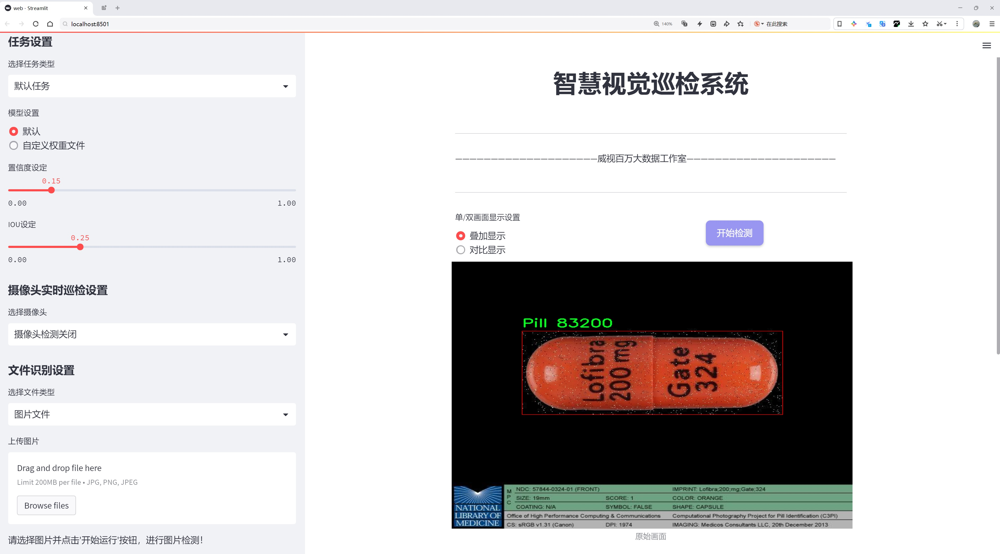
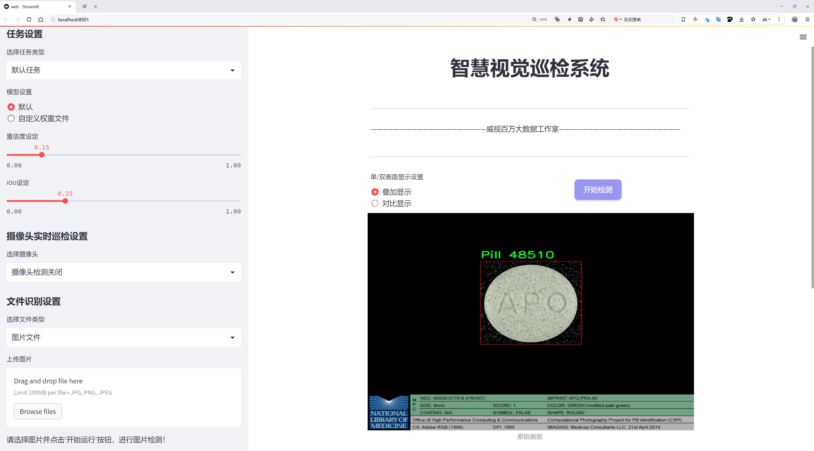
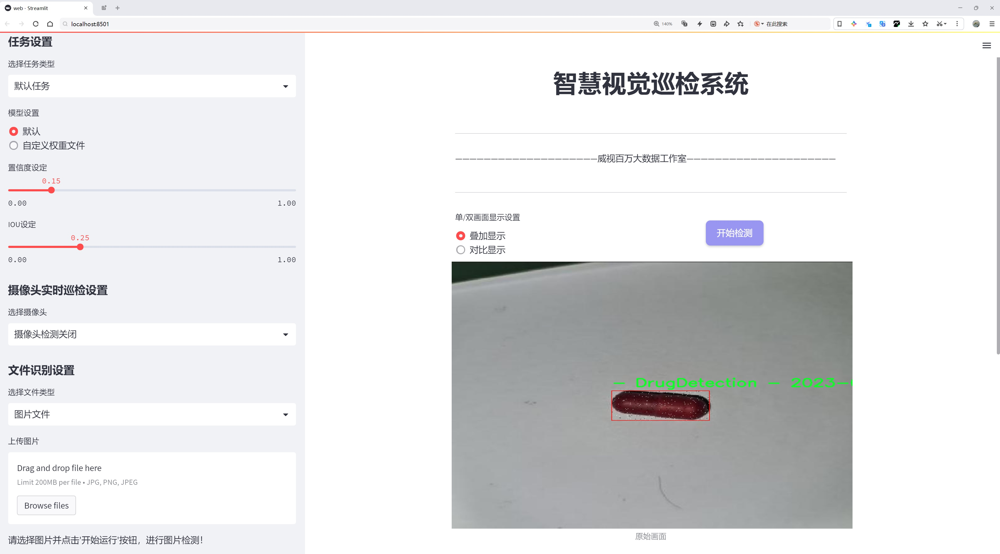
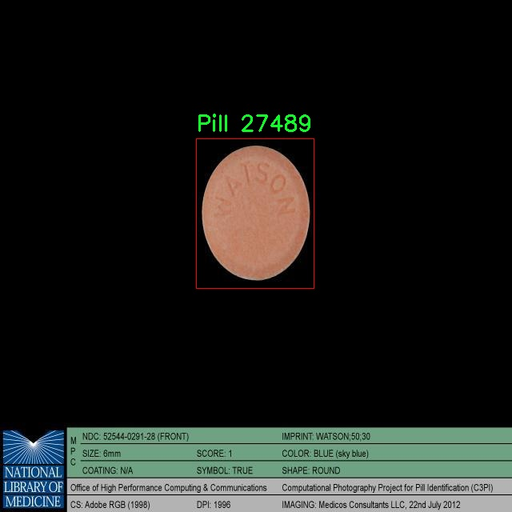
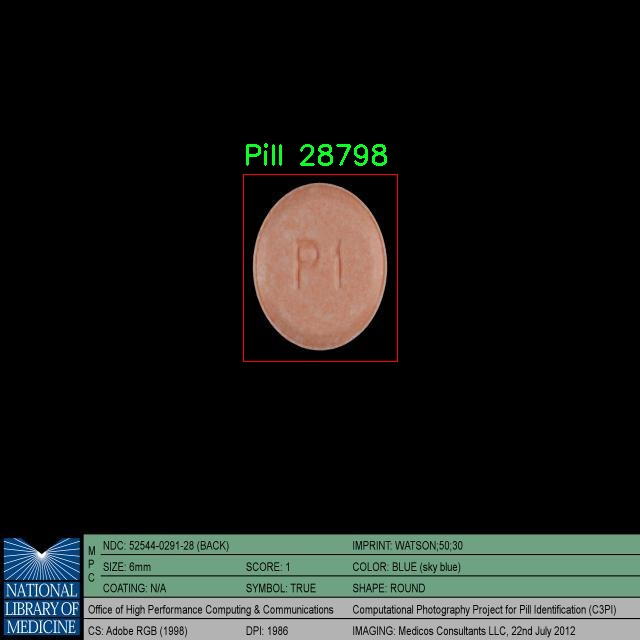
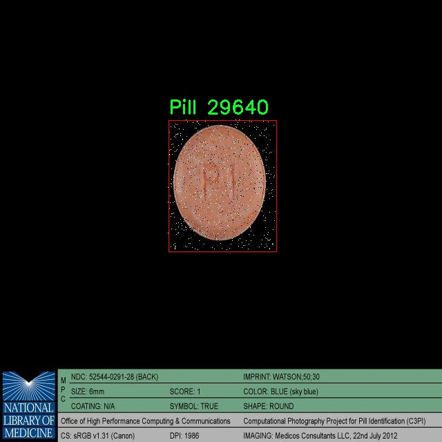
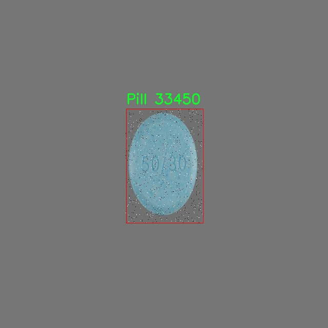

# 药物检测检测系统源码分享
 # [一条龙教学YOLOV8标注好的数据集一键训练_70+全套改进创新点发刊_Web前端展示]

### 1.研究背景与意义

项目参考[AAAI Association for the Advancement of Artificial Intelligence](https://gitee.com/qunmasj/projects)

项目来源[AACV Association for the Advancement of Computer Vision](https://github.com/qunshansj/good)

研究背景与意义

随着全球人口的不断增长和医疗需求的日益增加，药物的安全性和有效性成为了公共卫生领域的重要议题。药物滥用、假药泛滥以及药物管理不善等问题，严重威胁着人们的健康。因此，开发高效、准确的药物检测系统显得尤为重要。近年来，计算机视觉技术的迅猛发展为药物检测提供了新的解决方案，尤其是基于深度学习的目标检测算法在图像识别领域展现出了卓越的性能。其中，YOLO（You Only Look Once）系列算法因其实时性和高准确率而受到广泛关注。

YOLOv8作为YOLO系列的最新版本，进一步优化了模型的结构和算法，提升了目标检测的速度和精度。基于YOLOv8的药物检测系统，能够在复杂的环境中快速识别和分类药物图像，为药物管理和安全监测提供了强有力的技术支持。本研究旨在通过改进YOLOv8算法，构建一个高效的药物检测系统，以应对日益严峻的药物安全问题。

本研究所使用的数据集包含3545张药物图像，涵盖了两类药物（药丸）。这一数据集的构建为药物检测系统的训练和测试提供了坚实的基础。通过对该数据集的深入分析，我们可以识别出药物的多样性和复杂性，从而为模型的优化提供指导。药物的外观、形状、颜色和标签等特征在不同品牌和类型之间存在显著差异，这使得药物检测任务具有一定的挑战性。因此，改进YOLOv8算法以提高其对药物图像的识别能力，具有重要的现实意义。

此外，药物检测系统的应用不仅限于医疗机构和药品监管部门，还可以扩展到药品零售、电子商务等领域。通过实时监测和识别药物，能够有效防止假药流入市场，保护消费者的合法权益。同时，该系统还可以为药品的库存管理、过期药物的识别等提供技术支持，提高药品管理的效率和安全性。

综上所述，基于改进YOLOv8的药物检测系统的研究，不仅具有重要的学术价值，还有着广泛的应用前景。通过对药物检测技术的深入探索，我们希望能够为药物安全管理提供新的思路和方法，推动相关领域的技术进步与发展。未来，随着数据集的不断丰富和算法的持续优化，药物检测系统的准确性和实用性将进一步提升，为保障公众健康贡献力量。

### 2.图片演示







##### 注意：由于此博客编辑较早，上面“2.图片演示”和“3.视频演示”展示的系统图片或者视频可能为老版本，新版本在老版本的基础上升级如下：（实际效果以升级的新版本为准）

  （1）适配了YOLOV8的“目标检测”模型和“实例分割”模型，通过加载相应的权重（.pt）文件即可自适应加载模型。

  （2）支持“图片识别”、“视频识别”、“摄像头实时识别”三种识别模式。

  （3）支持“图片识别”、“视频识别”、“摄像头实时识别”三种识别结果保存导出，解决手动导出（容易卡顿出现爆内存）存在的问题，识别完自动保存结果并导出到tempDir中。

  （4）支持Web前端系统中的标题、背景图等自定义修改，后面提供修改教程。

  另外本项目提供训练的数据集和训练教程,暂不提供权重文件（best.pt）,需要您按照教程进行训练后实现图片演示和Web前端界面演示的效果。

### 3.视频演示

[3.1 视频演示](https://www.bilibili.com/video/BV1dEpeeMERV/)

### 4.数据集信息展示

##### 4.1 本项目数据集详细数据（类别数＆类别名）

nc: 2
names: ['- DrugDetection - 2023-06-04 3-05am', 'Pill']


##### 4.2 本项目数据集信息介绍

数据集信息展示

在现代医学领域，药物检测的准确性和效率至关重要。为了推动这一领域的研究和应用，特别是在药物识别和分类方面，我们构建了一个名为“med_detect”的数据集，旨在为改进YOLOv8的药物检测系统提供强有力的支持。该数据集的设计不仅考虑了药物检测的实际需求，还充分利用了深度学习技术的优势，以提高药物识别的准确性和速度。

“med_detect”数据集包含了两种主要类别，分别是“DrugDetection”和“Pill”。这两类数据的选择反映了药物检测系统在实际应用中的广泛需求，尤其是在药物管理、临床试验和药物安全监测等方面。通过对这两类药物的深入分析和数据收集，我们能够为YOLOv8模型提供丰富的训练样本，从而提升其在药物检测任务中的表现。

数据集的构建过程经历了多个阶段。首先，我们从多个渠道收集了大量的药物图像，包括临床环境、药房以及实验室等场景。这些图像涵盖了不同种类的药物和药片，确保了数据集的多样性和代表性。其次，在数据标注阶段，我们采用了专业的药物识别人员对收集到的图像进行标注，确保每一张图像中的药物信息都准确无误。这一过程不仅提高了数据集的质量，也为后续的模型训练奠定了坚实的基础。

在数据集的组织结构上，“med_detect”遵循了标准化的格式，便于后续的模型训练和评估。每个类别的图像都被清晰地分类，并附有详细的标签信息。这种结构化的数据管理方式使得研究人员能够快速检索和使用所需的数据，从而提高了研究的效率。

为了确保数据集的有效性和可靠性，我们还进行了多轮的验证和测试。通过与现有的药物检测系统进行对比，我们发现“med_detect”数据集在提高YOLOv8模型的检测精度和召回率方面表现优异。这一成果不仅证明了数据集的有效性，也为未来的药物检测研究提供了宝贵的参考。

总之，“med_detect”数据集的构建和应用为药物检测领域带来了新的机遇。通过与YOLOv8模型的结合，我们期待能够在药物识别的准确性和效率上取得突破，推动药物检测技术的进步。这一数据集不仅是研究人员的重要资源，也是推动药物安全和健康管理的重要工具。随着数据集的不断完善和扩展，我们相信其在药物检测领域的应用前景将更加广阔。










### 5.全套项目环境部署视频教程（零基础手把手教学）

[5.1 环境部署教程链接（零基础手把手教学）](https://www.ixigua.com/7404473917358506534?logTag=c807d0cbc21c0ef59de5)


[5.2 安装Python虚拟环境创建和依赖库安装视频教程链接（零基础手把手教学）](https://www.ixigua.com/7404474678003106304?logTag=1f1041108cd1f708b01a)

### 6.手把手YOLOV8训练视频教程（零基础小白有手就能学会）

[6.1 环境部署教程链接（零基础手把手教学）](https://www.ixigua.com/7404477157818401292?logTag=d31a2dfd1983c9668658)

### 7.70+种全套YOLOV8创新点代码加载调参视频教程（一键加载写好的改进模型的配置文件）

[7.1 环境部署教程链接（零基础手把手教学）](https://www.ixigua.com/7404478314661806627?logTag=29066f8288e3f4eea3a4)

### 8.70+种全套YOLOV8创新点原理讲解（非科班也可以轻松写刊发刊，V10版本正在科研待更新）

由于篇幅限制，每个创新点的具体原理讲解就不一一展开，具体见下列网址中的创新点对应子项目的技术原理博客网址【Blog】：


[8.1 70+种全套YOLOV8创新点原理讲解链接](https://gitee.com/qunmasj/good)

### 9.系统功能展示（检测对象为举例，实际内容以本项目数据集为准）

图9.1.系统支持检测结果表格显示

  图9.2.系统支持置信度和IOU阈值手动调节

  图9.3.系统支持自定义加载权重文件best.pt(需要你通过步骤5中训练获得)

  图9.4.系统支持摄像头实时识别

  图9.5.系统支持图片识别

  图9.6.系统支持视频识别

  图9.7.系统支持识别结果文件自动保存

  图9.8.系统支持Excel导出检测结果数据


### 10.原始YOLOV8算法原理

原始YOLOv8算法原理

YOLOv8（You Only Look Once version 8）是目标检测领域的最新进展之一，承载着前几代YOLO模型的成功经验，并在此基础上进行了多项重要的改进和优化。作为一种端到端的目标检测算法，YOLOv8以其高效性和准确性而受到广泛关注，尤其是在实时应用场景中表现尤为突出。其核心原理围绕着三个主要结构：Backbone、Neck和Head，这些结构的协同作用使得YOLOv8能够在复杂的视觉任务中实现卓越的性能。

首先，Backbone部分负责特征提取，它是YOLOv8的基础，采用了跨级结构（Cross Stage Partial, CSP）的设计理念。这种设计不仅提高了特征提取的效率，还有效减少了模型的参数量。YOLOv8在这一部分对YOLOv5中的C3模块进行了优化，替换为更加轻量的结构，旨在降低计算复杂度的同时保持特征提取的能力。此外，Backbone中还保留了空间金字塔池化模块（SPP），这一模块能够有效地处理不同尺度的特征，使得模型在面对多样化的目标时，依然能够保持较高的检测精度。

接下来是Neck部分，它的主要功能是对来自Backbone的特征进行融合。YOLOv8在这一阶段依然使用了特征金字塔的思想，通过多层次的特征融合，增强了模型对不同尺寸目标的检测能力。值得注意的是，YOLOv8在Neck部分删除了上采样阶段中的卷积结构，这一改动使得特征融合过程更加高效，同时减少了计算资源的消耗。这种优化使得YOLOv8在处理实时视频流时，能够以更快的速度进行目标检测。

最后，Head部分负责将经过Neck处理后的特征进行解码，输出最终的检测结果。YOLOv8采用了三个解耦头，分别负责边界框的回归、目标分类和目标置信度的预测。这种解耦设计使得每个头部可以独立优化，从而提高了模型的整体性能。此外，YOLOv8引入了新的损失策略，通过变焦损失（Focal Loss）计算分类损失，并结合数据平均保真度损失和完美交并比损失（IoU Loss）来计算边界框损失。这一创新的损失函数设计，使得YOLOv8在面对复杂场景时，能够更准确地定位目标，减少误检和漏检的情况。

在模型设置方面，YOLOv8提供了灵活的参数配置，包括depth_factor、width_factor和ratio等。这些参数的设置直接影响到模型的深度和宽度，从而影响到模型的复杂度和性能。通过调整这些参数，用户可以根据具体应用场景的需求，选择合适的模型配置，以达到最佳的检测效果。

YOLOv8的设计不仅注重模型的准确性，还考虑到了实际应用中的效率问题。通过轻量化的特征提取网络和优化的结构设计，YOLOv8能够在保持高精度的同时，显著提升推理速度。这使得YOLOv8在移动设备和边缘计算场景中，展现出良好的应用前景。

综上所述，YOLOv8作为目标检测领域的前沿模型，凭借其创新的结构设计和高效的算法实现，成为了业界广泛认可的解决方案。其在特征提取、特征融合和目标解码等多个环节的优化，使得YOLOv8不仅能够处理多样化的目标检测任务，还能够在实时性要求较高的应用中，提供可靠的性能支持。随着YOLOv8的不断发展和应用，未来在目标检测领域的研究和实践中，必将带来更多的创新和突破。


### 11.项目核心源码讲解（再也不用担心看不懂代码逻辑）

#### 11.1 ultralytics\models\fastsam\__init__.py

以下是对提供代码的逐行分析和核心部分的保留，同时进行了详细的中文注释：

```python
# Ultralytics YOLO 🚀, AGPL-3.0 license

# 从当前包中导入 FastSAM 模型类
from .model import FastSAM

# 从当前包中导入 FastSAMPredictor 类，用于预测
from .predict import FastSAMPredictor

# 从当前包中导入 FastSAMPrompt 类，用于处理提示信息
from .prompt import FastSAMPrompt

# 从当前包中导入 FastSAMValidator 类，用于验证模型性能
from .val import FastSAMValidator

# 定义当前模块的公共接口，允许外部访问这些类
__all__ = "FastSAMPredictor", "FastSAM", "FastSAMPrompt", "FastSAMValidator"
```

### 核心部分分析

1. **导入模块**：
   - 代码通过 `from .module import ClassName` 的方式导入了多个类，这些类分别负责模型的不同功能。
   - `FastSAM` 是核心模型类，负责模型的结构和功能。
   - `FastSAMPredictor` 是用于进行预测的类，负责将输入数据传入模型并获取输出。
   - `FastSAMPrompt` 处理用户输入的提示信息，可能用于模型的交互。
   - `FastSAMValidator` 用于验证模型的性能，确保模型的准确性和有效性。

2. **公共接口**：
   - `__all__` 变量定义了当前模块对外暴露的接口，允许用户通过 `from module import *` 的方式导入指定的类。这有助于管理模块的可见性，避免不必要的内部实现细节暴露给用户。

### 总结
以上代码是一个模块的初始化文件，主要负责导入模型及其相关功能类，并定义了模块的公共接口。通过这些类，用户可以方便地使用模型进行预测、处理输入和验证模型性能。

这个文件是一个Python模块的初始化文件，通常用于定义模块的公共接口。在这个特定的文件中，首先有一个注释，表明这是与Ultralytics YOLO相关的代码，并且该代码遵循AGPL-3.0许可证。

接下来，文件通过`from ... import ...`语句导入了四个类或函数，分别是`FastSAM`、`FastSAMPredictor`、`FastSAMPrompt`和`FastSAMValidator`。这些导入的内容来自于同一模块中的不同文件。具体来说：

- `FastSAM`可能是一个核心模型类，负责实现FastSAM算法的主要功能。
- `FastSAMPredictor`可能是一个用于进行预测的类，能够利用`FastSAM`模型进行推断。
- `FastSAMPrompt`可能涉及到与用户交互的功能，比如提供输入提示或处理用户输入。
- `FastSAMValidator`可能用于验证模型的性能或准确性，确保模型在特定数据集上的表现符合预期。

最后，`__all__`变量定义了该模块的公共接口，指定了在使用`from module import *`语句时，哪些名称会被导入。这里列出的名称是`FastSAMPredictor`、`FastSAM`、`FastSAMPrompt`和`FastSAMValidator`，这意味着这些是模块的主要组成部分，用户在使用这个模块时可以直接访问这些类或函数。

总的来说，这个文件的主要作用是组织和导出模块中的关键组件，使得其他模块或用户能够方便地使用这些功能。

#### 11.2 ui.py

```python
import sys
import subprocess

def run_script(script_path):
    """
    使用当前 Python 环境运行指定的脚本。

    Args:
        script_path (str): 要运行的脚本路径

    Returns:
        None
    """
    # 获取当前 Python 解释器的路径
    python_path = sys.executable

    # 构建运行命令
    command = f'"{python_path}" -m streamlit run "{script_path}"'

    # 执行命令
    result = subprocess.run(command, shell=True)
    if result.returncode != 0:
        print("脚本运行出错。")


# 实例化并运行应用
if __name__ == "__main__":
    # 指定您的脚本路径
    script_path = "web.py"  # 这里可以直接指定脚本路径

    # 运行脚本
    run_script(script_path)
```

### 代码注释说明：

1. **导入模块**：
   - `import sys`：导入系统相关的模块，用于获取当前 Python 解释器的路径。
   - `import subprocess`：导入子进程模块，用于在 Python 中执行外部命令。

2. **定义 `run_script` 函数**：
   - 该函数接收一个参数 `script_path`，表示要运行的 Python 脚本的路径。
   - 函数内部首先获取当前 Python 解释器的路径，存储在 `python_path` 变量中。
   - 然后构建一个命令字符串 `command`，用于运行指定的脚本，使用 `streamlit` 模块。
   - 使用 `subprocess.run` 方法执行构建的命令，并将 `shell` 参数设置为 `True`，以便在 shell 中运行命令。
   - 如果命令执行返回的状态码不为 0，表示脚本运行出错，打印错误信息。

3. **主程序入口**：
   - `if __name__ == "__main__":`：确保只有在直接运行该脚本时才会执行以下代码。
   - 指定要运行的脚本路径 `script_path`，这里直接使用 `"web.py"`。
   - 调用 `run_script` 函数，传入脚本路径，执行该脚本。

这个程序文件的主要功能是通过当前的 Python 环境来运行一个指定的脚本，具体来说是一个名为 `web.py` 的脚本。程序首先导入了必要的模块，包括 `sys`、`os` 和 `subprocess`，以及一个自定义的 `abs_path` 函数，这个函数可能用于获取脚本的绝对路径。

在 `run_script` 函数中，首先获取当前 Python 解释器的路径，这样可以确保使用正确的 Python 环境来执行脚本。接着，构建一个命令字符串，该命令将使用 `streamlit` 模块来运行指定的脚本。`streamlit` 是一个用于构建数据应用的流行库。

然后，使用 `subprocess.run` 方法来执行构建好的命令。这个方法会在一个新的进程中运行命令，并等待其完成。如果脚本运行过程中出现错误（即返回码不为0），程序会打印出“脚本运行出错”的提示信息。

在文件的最后部分，使用 `if __name__ == "__main__":` 语句来确保只有在直接运行该文件时才会执行下面的代码。这部分代码指定了要运行的脚本路径（通过 `abs_path` 函数获取 `web.py` 的绝对路径），并调用 `run_script` 函数来执行这个脚本。

总的来说，这个程序的目的是提供一个简单的接口，通过命令行运行一个指定的 Python 脚本，并处理可能出现的错误。

#### 11.3 ultralytics\models\rtdetr\predict.py

以下是代码中最核心的部分，并附上详细的中文注释：

```python
import torch
from ultralytics.data.augment import LetterBox
from ultralytics.engine.predictor import BasePredictor
from ultralytics.engine.results import Results
from ultralytics.utils import ops

class RTDETRPredictor(BasePredictor):
    """
    RT-DETR（实时检测变换器）预测器，扩展自BasePredictor类，用于使用百度的RT-DETR模型进行预测。

    该类利用视觉变换器的强大功能，提供实时物体检测，同时保持高精度。它支持高效的混合编码和IoU感知查询选择等关键特性。
    """

    def postprocess(self, preds, img, orig_imgs):
        """
        对模型的原始预测结果进行后处理，以生成边界框和置信度分数。

        该方法根据置信度和类（如果在`self.args`中指定）过滤检测结果。

        参数:
            preds (torch.Tensor): 模型的原始预测结果。
            img (torch.Tensor): 处理后的输入图像。
            orig_imgs (list或torch.Tensor): 原始的未处理图像。

        返回:
            (list[Results]): 包含后处理的边界框、置信度分数和类别标签的Results对象列表。
        """
        # 获取预测结果的维度
        nd = preds[0].shape[-1]
        # 分离边界框和分数
        bboxes, scores = preds[0].split((4, nd - 4), dim=-1)

        # 如果输入图像不是列表，则将其转换为numpy数组
        if not isinstance(orig_imgs, list):
            orig_imgs = ops.convert_torch2numpy_batch(orig_imgs)

        results = []
        for i, bbox in enumerate(bboxes):  # 遍历每个边界框
            bbox = ops.xywh2xyxy(bbox)  # 将边界框从xywh格式转换为xyxy格式
            score, cls = scores[i].max(-1, keepdim=True)  # 获取每个边界框的最大分数和对应的类别
            idx = score.squeeze(-1) > self.args.conf  # 根据置信度过滤边界框
            if self.args.classes is not None:
                # 如果指定了类别，则进一步过滤
                idx = (cls == torch.tensor(self.args.classes, device=cls.device)).any(1) & idx
            # 过滤后的预测结果
            pred = torch.cat([bbox, score, cls], dim=-1)[idx]
            orig_img = orig_imgs[i]  # 获取原始图像
            oh, ow = orig_img.shape[:2]  # 获取原始图像的高度和宽度
            # 将边界框的坐标转换为原始图像的尺寸
            pred[..., [0, 2]] *= ow
            pred[..., [1, 3]] *= oh
            img_path = self.batch[0][i]  # 获取图像路径
            # 将结果添加到列表中
            results.append(Results(orig_img, path=img_path, names=self.model.names, boxes=pred))
        return results

    def pre_transform(self, im):
        """
        在将输入图像输入模型进行推理之前，对其进行预处理。输入图像被调整为正方形的长宽比并填充。

        参数:
            im (list[np.ndarray] | torch.Tensor): 输入图像，形状为(N,3,h,w)的张量，或[(h,w,3) x N]的列表。

        返回:
            (list): 预处理后的图像列表，准备进行模型推理。
        """
        letterbox = LetterBox(self.imgsz, auto=False, scaleFill=True)  # 创建LetterBox对象以进行图像调整
        return [letterbox(image=x) for x in im]  # 对每个图像进行调整并返回
```

### 代码核心部分解释：
1. **RTDETRPredictor类**：该类是一个预测器，使用RT-DETR模型进行物体检测。它继承自`BasePredictor`类，提供了预测功能。
2. **postprocess方法**：该方法对模型的原始预测结果进行后处理，生成边界框和置信度分数，并根据置信度和类别进行过滤，最终返回一个包含结果的列表。
3. **pre_transform方法**：该方法在推理之前对输入图像进行预处理，确保图像为正方形并进行适当的缩放，以适应模型的输入要求。

这个程序文件是一个用于实时目标检测的预测器，名为`RTDETRPredictor`，它继承自`BasePredictor`类，专门用于使用百度的RT-DETR模型进行预测。RT-DETR模型结合了视觉变换器的优势，能够在保持高精度的同时实现实时的目标检测。该类支持高效的混合编码和IoU（Intersection over Union）感知的查询选择等关键特性。

在文件的开头，导入了一些必要的库和模块，包括`torch`和一些来自`ultralytics`的工具和类。接着，定义了`RTDETRPredictor`类，并在类的文档字符串中描述了其功能和用法示例。用户可以通过创建`RTDETRPredictor`的实例并调用`predict_cli`方法来进行预测。

该类有两个主要的属性：`imgsz`和`args`。`imgsz`指定了推理时的图像大小，要求为正方形并且填充比例正确；`args`则是用于覆盖预测器参数的字典。

在`postprocess`方法中，模型的原始预测结果会被后处理，以生成边界框和置信度分数。该方法会根据置信度和类别对检测结果进行过滤。首先，从模型的预测结果中分离出边界框和分数，然后将输入图像转换为NumPy数组（如果它们不是列表的话）。接着，遍历每个边界框，进行坐标转换，并根据置信度和类别进行筛选，最终生成一个包含后处理结果的`Results`对象列表。

`pre_transform`方法用于在将输入图像送入模型进行推理之前进行预处理。它将输入图像进行信箱填充，以确保图像的长宽比为正方形，并且填充比例正确。该方法接受一个图像列表或张量，并返回一个经过预处理的图像列表，准备好进行模型推理。

总体而言，这个文件实现了一个高效的实时目标检测预测器，能够处理输入图像并生成相应的检测结果。

#### 11.4 ultralytics\solutions\distance_calculation.py

以下是代码中最核心的部分，并附上详细的中文注释：

```python
import math
import cv2
from ultralytics.utils.checks import check_imshow
from ultralytics.utils.plotting import Annotator, colors

class DistanceCalculation:
    """用于实时视频流中计算两个物体之间距离的类。"""

    def __init__(self):
        """初始化距离计算类，设置默认的视觉、图像、跟踪和距离参数。"""
        self.im0 = None  # 当前帧图像
        self.annotator = None  # 注释器，用于绘制框和标签
        self.view_img = False  # 是否显示图像
        self.line_color = (255, 255, 0)  # 线条颜色
        self.centroid_color = (255, 0, 255)  # 重心颜色

        self.clss = None  # 物体类别
        self.names = None  # 物体名称
        self.boxes = None  # 边界框
        self.line_thickness = 2  # 边界框线条厚度
        self.trk_ids = None  # 跟踪ID

        self.centroids = []  # 存储重心
        self.pixel_per_meter = 10  # 像素与米的比例

        self.left_mouse_count = 0  # 左键点击计数
        self.selected_boxes = {}  # 存储选中的边界框

        # 检查环境是否支持imshow
        self.env_check = check_imshow(warn=True)

    def extract_tracks(self, tracks):
        """
        从提供的数据中提取结果。

        Args:
            tracks (list): 从物体跟踪过程中获得的轨迹列表。
        """
        self.boxes = tracks[0].boxes.xyxy.cpu()  # 获取边界框坐标
        self.clss = tracks[0].boxes.cls.cpu().tolist()  # 获取物体类别
        self.trk_ids = tracks[0].boxes.id.int().cpu().tolist()  # 获取跟踪ID

    def calculate_centroid(self, box):
        """
        计算边界框的重心。

        Args:
            box (list): 边界框数据
        """
        return int((box[0] + box[2]) // 2), int((box[1] + box[3]) // 2)  # 返回重心坐标

    def calculate_distance(self, centroid1, centroid2):
        """
        计算两个重心之间的距离。

        Args:
            centroid1 (point): 第一个重心坐标
            centroid2 (point): 第二个重心坐标
        """
        pixel_distance = math.sqrt((centroid1[0] - centroid2[0]) ** 2 + (centroid1[1] - centroid2[1]) ** 2)  # 计算像素距离
        return pixel_distance / self.pixel_per_meter  # 返回实际距离（米）

    def plot_distance_and_line(self, distance):
        """
        在帧上绘制距离和线条。

        Args:
            distance (float): 两个重心之间的距离
        """
        cv2.rectangle(self.im0, (15, 25), (280, 70), (255, 255, 255), -1)  # 绘制背景矩形
        cv2.putText(
            self.im0, f"Distance : {distance:.2f}m", (20, 55), cv2.FONT_HERSHEY_SIMPLEX, 0.8, (0, 0, 0), 2, cv2.LINE_AA
        )  # 显示距离文本
        cv2.line(self.im0, self.centroids[0], self.centroids[1], self.line_color, 3)  # 绘制连接线
        cv2.circle(self.im0, self.centroids[0], 6, self.centroid_color, -1)  # 绘制第一个重心
        cv2.circle(self.im0, self.centroids[1], 6, self.centroid_color, -1)  # 绘制第二个重心

    def start_process(self, im0, tracks):
        """
        根据跟踪数据计算两个边界框之间的距离。

        Args:
            im0 (nd array): 图像
            tracks (list): 从物体跟踪过程中获得的轨迹列表。
        """
        self.im0 = im0  # 保存当前帧图像
        if tracks[0].boxes.id is None:  # 如果没有检测到物体
            if self.view_img:
                self.display_frames()  # 显示帧
            return

        self.extract_tracks(tracks)  # 提取跟踪数据

        self.annotator = Annotator(self.im0, line_width=2)  # 初始化注释器

        for box, cls, track_id in zip(self.boxes, self.clss, self.trk_ids):
            self.annotator.box_label(box, color=colors(int(cls), True), label=self.names[int(cls)])  # 绘制边界框和标签

            if len(self.selected_boxes) == 2:  # 如果选中了两个边界框
                for trk_id, _ in self.selected_boxes.items():
                    if trk_id == track_id:
                        self.selected_boxes[track_id] = box  # 更新选中的边界框

        if len(self.selected_boxes) == 2:  # 如果选中了两个边界框
            for trk_id, box in self.selected_boxes.items():
                centroid = self.calculate_centroid(self.selected_boxes[trk_id])  # 计算重心
                self.centroids.append(centroid)  # 添加重心到列表

            distance = self.calculate_distance(self.centroids[0], self.centroids[1])  # 计算距离
            self.plot_distance_and_line(distance)  # 绘制距离和线条

        self.centroids = []  # 清空重心列表

        if self.view_img and self.env_check:  # 如果需要显示图像且环境支持
            self.display_frames()  # 显示帧

        return im0  # 返回处理后的图像

    def display_frames(self):
        """显示帧。"""
        cv2.namedWindow("Ultralytics Distance Estimation")  # 创建窗口
        cv2.setMouseCallback("Ultralytics Distance Estimation", self.mouse_event_for_distance)  # 设置鼠标回调
        cv2.imshow("Ultralytics Distance Estimation", self.im0)  # 显示图像

        if cv2.waitKey(1) & 0xFF == ord("q"):  # 按下'q'键退出
            return

if __name__ == "__main__":
    DistanceCalculation()  # 实例化距离计算类
```

以上代码是一个用于实时视频流中计算物体之间距离的类。它通过鼠标事件选择物体，并计算选中物体的重心之间的距离，最后在图像上绘制出距离和相关信息。

这个程序文件定义了一个名为 `DistanceCalculation` 的类，主要用于在实时视频流中计算两个物体之间的距离。该类的功能包括处理图像、提取跟踪信息、计算物体的质心以及在图像上绘制距离和相关信息。

在初始化方法 `__init__` 中，类设置了一些默认值，包括图像信息、跟踪信息、距离计算参数和鼠标事件计数器。它还检查当前环境是否支持图像显示。

`set_args` 方法用于配置距离计算和显示参数，允许用户设置物体类别名称、每米的像素数、是否显示图像、线条厚度以及颜色等。

`mouse_event_for_distance` 方法处理鼠标事件，允许用户通过点击选择要计算距离的两个物体。当用户左键点击时，程序会记录被点击的物体的边界框；如果用户右键点击，则会重置选择。

`extract_tracks` 方法从跟踪数据中提取物体的边界框、类别和跟踪ID。

`calculate_centroid` 方法计算给定边界框的质心坐标。

`calculate_distance` 方法计算两个质心之间的距离，使用欧几里得距离公式，并将其转换为实际的米数。

`plot_distance_and_line` 方法在图像上绘制距离信息和连接两个质心的线条。

`start_process` 方法是该类的核心功能，接收图像和跟踪数据，提取物体信息，计算并绘制选定物体之间的距离。如果选定了两个物体，它会计算它们的质心并调用绘制函数。

`display_frames` 方法用于显示处理后的图像，并设置鼠标回调函数以处理用户输入。

最后，在 `__main__` 部分，创建了 `DistanceCalculation` 类的实例。这个程序可以用于实时视频监控或其他需要计算物体间距离的应用场景。

#### 11.5 train.py

以下是代码中最核心的部分，并附上详细的中文注释：

```python
import os
import torch
import yaml
from ultralytics import YOLO  # 导入YOLO模型库
from QtFusion.path import abs_path  # 导入路径处理工具

# 检测是否有可用的GPU，如果有则使用GPU，否则使用CPU
device = "0" if torch.cuda.is_available() else "cpu"

if __name__ == '__main__':  # 确保该模块被直接运行时才执行以下代码
    workers = 1  # 设置数据加载的工作进程数
    batch = 2    # 设置每个批次的大小

    data_name = "data"  # 数据集名称
    # 获取数据集配置文件的绝对路径
    data_path = abs_path(f'datasets/{data_name}/{data_name}.yaml', path_type='current')  
    unix_style_path = data_path.replace(os.sep, '/')  # 将路径转换为Unix风格

    # 获取数据集目录路径
    directory_path = os.path.dirname(unix_style_path)
    
    # 读取YAML格式的数据集配置文件
    with open(data_path, 'r') as file:
        data = yaml.load(file, Loader=yaml.FullLoader)
    
    # 如果配置文件中有'path'项，则修改为当前目录路径
    if 'path' in data:
        data['path'] = directory_path
        # 将修改后的数据写回YAML文件
        with open(data_path, 'w') as file:
            yaml.safe_dump(data, file, sort_keys=False)

    # 加载YOLOv8模型的配置文件
    model = YOLO(model='./ultralytics/cfg/models/v8/yolov8s.yaml', task='detect')  
    
    # 开始训练模型
    results2 = model.train(
        data=data_path,  # 指定训练数据的配置文件路径
        device=device,  # 使用选择的设备（GPU或CPU）
        workers=workers,  # 使用的工作进程数
        imgsz=640,  # 输入图像的大小为640x640
        epochs=100,  # 训练100个epoch
        batch=batch,  # 每个批次的大小
        name='train_v8_' + data_name  # 指定训练任务的名称
    )
```

### 代码核心部分说明：
1. **设备选择**：通过 `torch.cuda.is_available()` 检测是否有可用的GPU，并相应地设置 `device` 变量。
2. **数据集路径处理**：通过 `abs_path` 函数获取数据集的绝对路径，并将路径格式转换为Unix风格，以确保在不同操作系统上都能正确处理。
3. **YAML文件读取与修改**：读取数据集的配置文件，检查并更新其中的 `path` 项为当前目录路径，然后将修改后的内容写回文件。
4. **模型加载与训练**：加载YOLOv8模型，并使用指定的参数开始训练，包括数据路径、设备、工作进程数、图像大小、训练轮数和批次大小。

这个程序文件`train.py`主要用于训练YOLOv8目标检测模型。首先，它导入了必要的库，包括`os`、`torch`、`yaml`和`ultralytics`中的YOLO模型。程序首先检测当前是否有可用的GPU，如果有，则将设备设置为"0"（表示使用第一个GPU），否则使用CPU。

在`__main__`块中，程序定义了一些训练参数，包括工作进程数量`workers`和批次大小`batch`。接着，指定了数据集的名称为`data`，并构建了数据集配置文件的绝对路径。通过`abs_path`函数获取到该路径后，程序将路径中的分隔符统一替换为Unix风格的斜杠。

程序接下来获取了数据集目录的路径，并打开指定的YAML文件以读取数据集配置。它使用`yaml`库读取YAML文件，并在其中查找`path`项。如果找到该项，程序将其值修改为数据集的目录路径，并将修改后的内容写回到YAML文件中，以确保后续的训练能够正确找到数据集。

随后，程序加载了YOLOv8的预训练模型，指定了模型的配置文件路径。接下来，调用`model.train`方法开始训练模型，传入了一系列参数，包括数据配置文件路径、设备、工作进程数量、输入图像大小（640x640）、训练的epoch数量（100）以及每个批次的大小（2）。最后，训练任务的名称被设置为`train_v8_`加上数据集名称。

整体而言，这段代码的功能是准备数据集、配置YOLOv8模型，并启动训练过程。

#### 11.6 ultralytics\models\nas\__init__.py

以下是保留的核心部分代码，并附上详细的中文注释：

```python
# 导入必要的模块和类
from .model import NAS  # 从当前包的model模块中导入NAS类
from .predict import NASPredictor  # 从当前包的predict模块中导入NASPredictor类
from .val import NASValidator  # 从当前包的val模块中导入NASValidator类

# 定义模块的公共接口，只有这些类可以被外部访问
__all__ = "NASPredictor", "NASValidator", "NAS"  # 指定模块的公共接口
```

### 注释说明：
1. **导入模块**：
   - `from .model import NAS`：这行代码从当前包的`model`模块中导入`NAS`类，`NAS`可能是一个神经网络架构的定义。
   - `from .predict import NASPredictor`：这行代码从当前包的`predict`模块中导入`NASPredictor`类，`NASPredictor`可能用于进行模型的预测。
   - `from .val import NASValidator`：这行代码从当前包的`val`模块中导入`NASValidator`类，`NASValidator`可能用于验证模型的性能。

2. **定义公共接口**：
   - `__all__`是一个特殊变量，用于定义模块的公共接口。只有在`__all__`中列出的类和函数可以被外部导入，这样可以控制模块的可见性和使用方式。这里指定了`NASPredictor`、`NASValidator`和`NAS`三个类为公共接口。

这个程序文件是Ultralytics YOLO项目中的一个初始化文件，位于`ultralytics\models\nas\`目录下。文件的主要功能是定义该模块的公共接口，便于其他模块或程序导入和使用。

首先，文件顶部的注释表明该项目使用的是AGPL-3.0许可证，并且与Ultralytics YOLO相关。接下来，文件通过相对导入的方式引入了三个类：`NAS`、`NASPredictor`和`NASValidator`。这些类分别来自于同一目录下的`model`、`predict`和`val`模块。

`NAS`类可能是与神经架构搜索（Neural Architecture Search）相关的模型定义，而`NASPredictor`和`NASValidator`则分别用于模型的预测和验证功能。这种结构使得代码的组织更加清晰，便于维护和扩展。

最后，`__all__`变量定义了该模块的公共接口，指定了当使用`from module import *`语句时，哪些名称会被导入。这里列出的名称包括`NASPredictor`、`NASValidator`和`NAS`，这意味着这三个类是该模块的主要组成部分，用户可以直接使用它们，而不需要了解模块内部的实现细节。

总的来说，这个初始化文件的作用是为`ultralytics.models.nas`模块提供一个清晰的接口，方便其他部分的代码进行调用。

### 12.系统整体结构（节选）

### 整体功能和构架概括

该项目是一个基于Ultralytics YOLO（You Only Look Once）目标检测框架的实现，包含多个模块和功能，旨在提供高效的目标检测、模型训练、实时预测和距离计算等功能。项目结构清晰，模块化设计使得各个功能之间的耦合度较低，便于维护和扩展。

- **模型模块**：包含不同的目标检测模型（如FastSAM、RT-DETR、NAS等），每个模型都有独立的预测和验证功能。
- **训练模块**：提供训练YOLO模型的功能，支持数据集配置和训练参数设置。
- **用户界面模块**：实现与用户的交互，允许用户通过图形界面或命令行启动模型预测。
- **工具模块**：包含一些实用工具和函数，如下载、数据处理和回调函数等。
- **距离计算模块**：用于在视频流中计算和显示物体之间的距离。

### 文件功能整理表

| 文件路径                                       | 功能描述                                                                                       |
|----------------------------------------------|-----------------------------------------------------------------------------------------------|
| `ultralytics/models/fastsam/__init__.py`    | 初始化FastSAM模型模块，导出主要类和功能。                                                     |
| `ui.py`                                      | 提供用户界面，允许通过命令行运行指定的脚本（如web.py）。                                       |
| `ultralytics/models/rtdetr/predict.py`      | 实现RT-DETR模型的预测功能，包括图像预处理、后处理和距离计算。                                 |
| `ultralytics/solutions/distance_calculation.py` | 计算实时视频流中物体之间的距离，处理鼠标事件并在图像上绘制距离信息。                        |
| `train.py`                                   | 训练YOLOv8模型，配置数据集和训练参数，启动训练过程。                                         |
| `ultralytics/models/nas/__init__.py`        | 初始化NAS模型模块，导出主要类和功能。                                                         |
| `ultralytics/nn/modules/transformer.py`     | 实现Transformer相关的模块，可能用于模型的特征提取和处理。                                     |
| `ultralytics/hub/__init__.py`               | 初始化Hub模块，可能用于模型的加载和管理。                                                    |
| `ultralytics/hub/session.py`                 | 管理与Hub的会话，处理模型的下载和更新。                                                      |
| `ultralytics/utils/downloads.py`             | 提供下载功能，可能用于下载模型或数据集。                                                      |
| `ultralytics/data/utils.py`                  | 包含数据处理和转换的实用工具函数。                                                            |
| `chinese_name_list.py`                       | 可能用于处理中文名称列表，具体功能不明确。                                                    |
| `ultralytics/utils/callbacks/__init__.py`   | 初始化回调函数模块，可能用于训练过程中的事件处理和监控。                                     |

这个表格总结了项目中各个文件的主要功能，便于理解项目的整体架构和各个模块之间的关系。

注意：由于此博客编辑较早，上面“11.项目核心源码讲解（再也不用担心看不懂代码逻辑）”中部分代码可能会优化升级，仅供参考学习，完整“训练源码”、“Web前端界面”和“70+种创新点源码”以“13.完整训练+Web前端界面+70+种创新点源码、数据集获取”的内容为准。

### 13.完整训练+Web前端界面+70+种创新点源码、数据集获取


# [下载链接：https://mbd.pub/o/bread/ZpqcmZdw](https://mbd.pub/o/bread/ZpqcmZdw)